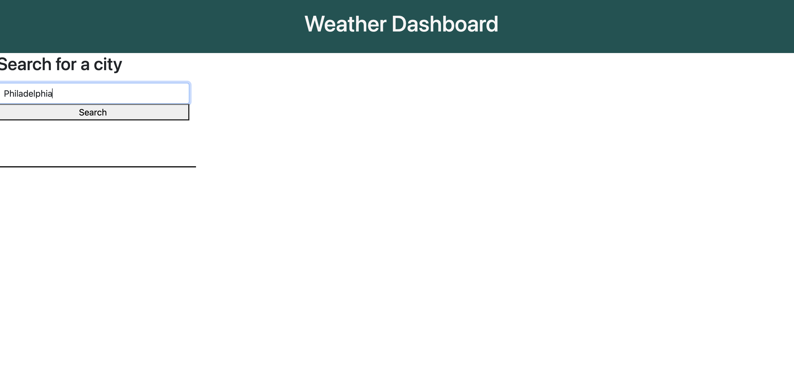
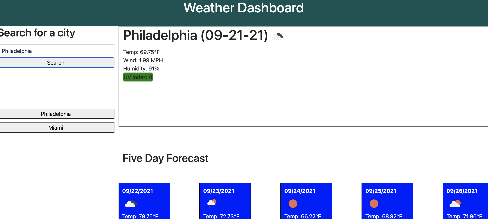

# weather-dashboard

## Description
This is a weather dashboard. When you search for a given city, current weather information loads in the main section of the webpage. Additionally, a 5-day forcast loads beneath that. When you search a city, a new button is generated that can be used to look up that city's details again.

## Table of Contents 
- [Installation](#installation)
- [Usage](#usage)
- [License](#license)

## Installation
To install this project, follow these steps:

1) Follow this link: https://github.com/jfisher37/weather-dashboard
2) Hit the green "Code" button.
3) Copy the link listed in the clone section (either HTTPS or SSH, if you have the appropriate permissions). 
4) Open your terminal (for MacOS) or GitBash (for Windows). 
5) Navigate to the directory in which you would like to place the project.
6) Type "git clone" followed by the link you copied earlier, then press Enter/Return.

## Usage
You can access the website here: 
https://jfisher37.github.io/weather-dashboard/

To use it, type a city name into the input field and press enter.

After you press enter, weather data for that city will be loaded.
   
   

## License
Copyright (c) 2021 Joseph Fisher

Permission is hereby granted, free of charge, to any person obtaining a copy
of this software and associated documentation files (the "Software"), to deal
in the Software without restriction, including without limitation the rights
to use, copy, modify, merge, publish, distribute, sublicense, and/or sell
copies of the Software, and to permit persons to whom the Software is
furnished to do so, subject to the following conditions:

The above copyright notice and this permission notice shall be included in all
copies or substantial portions of the Software.

THE SOFTWARE IS PROVIDED "AS IS", WITHOUT WARRANTY OF ANY KIND, EXPRESS OR
IMPLIED, INCLUDING BUT NOT LIMITED TO THE WARRANTIES OF MERCHANTABILITY,
FITNESS FOR A PARTICULAR PURPOSE AND NONINFRINGEMENT. IN NO EVENT SHALL THE
AUTHORS OR COPYRIGHT HOLDERS BE LIABLE FOR ANY CLAIM, DAMAGES OR OTHER
LIABILITY, WHETHER IN AN ACTION OF CONTRACT, TORT OR OTHERWISE, ARISING FROM,
OUT OF OR IN CONNECTION WITH THE SOFTWARE OR THE USE OR OTHER DEALINGS IN THE
SOFTWARE.

